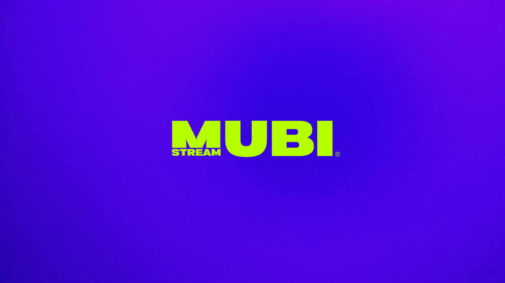

# Mubi — Streaming Refined. Cinema Redefined.

🎥 Mubi is a multi-platform movies tracker and streaming website for movies, series, tv and much more. Streaming is done through various free sources on the internet.

# TODO
- [ ] Add authentication and user profiles
- [ ] Add watchlists and favorites
- [ ] Improve UI/UX design (https://cdn.dribbble.com/userupload/5380061/file/original-aa0899bc666b65f6db18cce160742a4a.jpg?resize=1024x768&vertical=center)
- [ ] Add more streaming sources
- [ ] Add D-Pad (spacial navigation) support for TV devices
- [ ] Random movie suggestions
- [ ] Maybe a music app? (https://github.com/n-ce/ytify, https://github.com/codealchemist/youtube-audio-server, https://github.com/JamesKyburz/youtube-audio-stream)